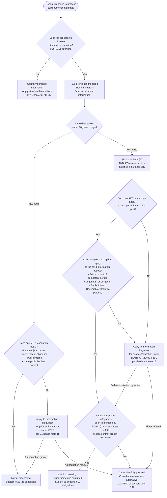

```mermaid
flowchart TD
    Start([School proposes to process<br/>pupil authentication data])

    Q1{Does the processing involve<br/>biometric information?<br/>POPIA §1 definition}

    OrdinaryPath[Ordinary personal information<br/>Apply standard 8 conditions<br/>POPIA Chapter 3, §8–25]

    S26[§26 prohibition triggered<br/>Biometric data is<br/>'special personal information']

    Q2{Is the data subject<br/>under 18 years of age?}

    %% Adult-only branch — section 27 only
    Q3a{Does any §27 1 exception apply?<br/>• Data subject consent<br/>• Legal right or obligation<br/>• Public interest<br/>• Made public by data subject}

    Lawful1[Lawful processing<br/>Subject to §8–25 conditions]

    PriorAuth1[Apply to Information Regulator<br/>for prior authorisation under §27 2<br/>per Guidance Note 18]

    %% Child branch — sections 27 AND 35 BOTH required
    Note1[§11 3 c — both §27<br/>AND §35 routes must be<br/>satisfied simultaneously]

    Q3b{Does any §27 1 exception apply<br/>to the special-information aspect?}

    Q4{Does any §35 1 exception apply<br/>to the child-information aspect?<br/>• Prior consent of competent person<br/>• Legal right or obligation<br/>• Public interest<br/>• Research or statistical purpose}

    Q5{Have appropriate safeguards<br/>been implemented?<br/>POPIA §19 — encrypted templates,<br/>access control, breach response}

    Lawful2[Lawful processing of<br/>pupil biometrics permitted<br/>Subject to ongoing §19 obligations]

    PriorAuth2[Apply to Information Regulator<br/>for prior authorisation under<br/>BOTH §27 2 AND §35 2<br/>per Guidance Note 18]

    Stop[Cannot lawfully proceed<br/>Consider less intrusive alternative<br/>e.g. RFID smart card with PIN]

    %% Edges
    Start --> Q1
    Q1 -- No --> OrdinaryPath
    Q1 -- Yes --> S26
    S26 --> Q2

    Q2 -- No, adult --> Q3a
    Q3a -- Yes --> Lawful1
    Q3a -- No --> PriorAuth1
    PriorAuth1 -- Authorisation granted --> Lawful1
    PriorAuth1 -- Authorisation refused --> Stop

    Q2 -- Yes, child --> Note1
    Note1 --> Q3b
    Q3b -- Yes --> Q4
    Q3b -- No --> PriorAuth2
    Q4 -- Yes --> Q5
    Q4 -- No --> PriorAuth2
    Q5 -- Yes --> Lawful2
    Q5 -- No --> Stop
    PriorAuth2 -- Both authorisations granted --> Q5
    PriorAuth2 -- Either refused --> Stop
```